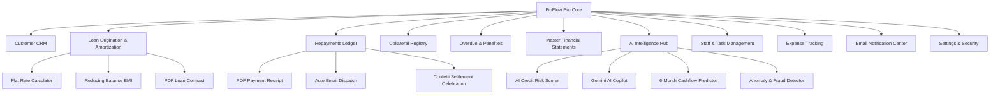

# 🏦 FinFlow Pro - Micro-Finance Management System & AI Credit Risk Operating System

<div align="center">


[](https://react.dev/)
[](https://www.typescriptlang.org/)
[](https://vitejs.dev/)
[](https://tailwindcss.com/)
[](https://dexie.org/)
[](https://ai.google.dev/)
[](https://dotnet.microsoft.com/)
[](https://github.com/Chathura0607/FinFlow-Pro)
[](LICENSE)

<p align="center">
  <b>An Enterprise-Grade, Local-First Micro-Finance Management System, AI Underwriting Intelligence Hub, and Financial ERP</b><br>
  Engineered with high performance client-side storage, real-time analytics, automated email dispatch, printable legal agreements, cryptographic security, and standalone Windows desktop packaging.
</p>

[✨ Key Innovations](#-key-innovations--architectural-highlights) •
[📱 Modules Deep Dive](#-modules--features-deep-dive) •
[🤖 AI Intelligence](#-ai-credit-risk--intelligence-engine) •
[🔒 Security & Cryptography](#-enterprise-security--data-integrity) •
[📊 Financial Formulas](#-financial--mathematical-formulas) •
[🚀 Quick Start](#-how-to-run-the-application) •
[🔑 Login Credentials](#-default-login-credentials)

---

</div>

## 🌟 Key Innovations & Architectural Highlights

### ⚡ 1. Zero-Server Local-First Architecture (Dexie.js / IndexedDB)
* **100% Client-Side Persistence**: Eliminates the overhead of configuring external SQL/MariaDB/MySQL servers. All data is securely stored inside the user's browser/workstation IndexedDB storage engine.
* **Sub-Millisecond Reactive Live Queries**: Uses `useLiveQuery` reactive bindings to instantly synchronize UI components across multiple tabs and windows upon data mutations.
* **Tamper-Evident 1-Click JSON Backup & Restore**: Full JSON database backup and recovery with integrated **SHA-256 Checksum Verification** to prevent file tampering or corruption.
* **Pre-Seeded Sample Dataset**: Includes realistic borrowers, SME loans, gold/vehicle/land collaterals, repayment histories, staff directory, and operational expenses ready for immediate evaluation.

### 🤖 2. Multi-Factor AI Credit Risk & Underwriting Engine
* **4-Factor Multi-Weighted Credit Scorer**: Evaluates borrower credit score, Debt-to-Income (DTI) ratio, collateral coverage margin, and past repayment history into a 0–100 index with categorized Risk Tiers (*Low, Moderate, High, Critical*).
* **Automated Terms & Condition Suggestions**: Algorithmic adjustments for maximum loan limits, suggested interest rate discounts/penalties, standing order mandates, and guarantor requirements.
* **FinFlow AI Financial Copilot**: Live conversational assistant that answers queries regarding overdue exposure, cash flow trends, borrower solvency, and P&L summaries in **English & Sinhala**. Powered by **Google Gemini API** with local rule-based heuristic fallback.
* **6-Month Cashflow & Profit Predictor**: Dynamic predictive modeling that projects future collections, operational expenses, penalty income, and net margins with interactive trend charts.
* **Anomaly & Fraud Detection**: Real-time surveillance of unsecured high-value loans, overdue aging spikes, and abnormal expense surges.

### 📧 3. Automated Digital Notifications & Outbox Engine
* **EmailJS Live Cloud Dispatch & Local Audited Dispatch**: Dispatches branded digital notices directly to borrower and staff email addresses with seamless fallback to an audited dispatch ledger.
* **Automated Notification Triggers**:
  * 🎉 **Loan Approval & Disbursement Letters**: Detailed welcome letters with principal, due date, installment schedule, and terms.
  * 💳 **Digital Repayment Receipts**: Transaction notices with receipt numbers, principal/interest allocation, and updated outstanding balance.
  * ⚠️ **Urgent Overdue Arrears Alerts**: Overdue notices with accrued daily penalty breakdowns (0.25%/day).
  * 🔒 **Security Verification OTPs**: One-Time Passwords for staff authentication and password resets.
* **Interactive Outbox Hub**: Search, filter, inspect delivery statuses (*Delivered, Simulated, Failed*), and compose custom broadcast notices.

### 📄 4. High-Fidelity Printable PDF Documents & Spreadsheet Exports
* **Official Branded Payment Receipts**: 1-click generation of PDF receipts with customer details, itemized principal/interest/penalty breakdown, remaining balance, and signature sections.
* **Legal Loan Agreement & Amortization Contract**: Printable borrower contracts with comprehensive legal terms, security details, and authorized officer signature fields.
* **1-Click Spreadsheet Exports**: Instant XLSX/CSV exports for Customers, Active Loans, Repayment Ledgers, Operational Expenses, and Master Financials using **SheetJS**.

### 🖥️ 5. Standalone Native Windows Executable (`FinFlow-Pro.exe`)
* **Dedicated Desktop Experience**: Packaged with a custom **C# .NET multithreaded HTTP Server** (`Launcher.cs`) that automatically binds an open port (5173–5200) and launches Chromium/Edge in native desktop app mode (`--app`).
* **Windows System Tray Integration**: Minimizes to system tray with quick-launch and graceful application shutdown controls.
* **Zero External Runtime Dependency**: Run directly on any modern Windows workstation without installing Node.js or browser dev servers.

---

## 📱 Modules & Features Deep Dive



---

### 1. 📊 Executive Dashboard & Portfolio Analytics
* **Real-Time KPI Cards**: Total Disbursed Capital, Total Recovered Cash, Outstanding Active Balance, Total Overdue Exposure, Net Operating Profit, and Portfolio Recovery Rate (%).
* **Interactive Visualizations (Recharts)**:
  * **Cashflow Overview (Area Chart)**: Monthly disbursements vs. collections.
  * **Portfolio Distribution (Donut Chart)**: Active, settled, overdue, and defaulted loan distribution.
  * **Monthly Financial Performance (Bar Chart)**: Revenue vs. operational expenses.
* **Live System Audit Stream**: Real-time timeline of customer onboarding, loan disbursements, payments, and security events.
* **Quick Access Action Bar**: 1-click shortcuts to register borrowers, disburse loans, record installments, and run AI risk assessments.

---

### 2. 👥 Customer & Borrower CRM
* **Comprehensive KYC Profiles**: Tracks full name, National Identity Card (NIC), phone, email, residential address, monthly income, employment status, and internal notes.
* **Strict Sri Lankan Format Validation**:
  * **NIC Validation**: Validates both **Old Format** (9 digits + `V`/`X`, e.g., `987654321V`) and **New Format** (12 digits, e.g., `199812345678`).
  * **Phone Validation**: Supports local and international formats (`0771234567`, `+94771234567`, `011...`).
* **Credit Score Rating Gauge**: 300 to 850 scoring range with visual rating badges (*Excellent, Good, Fair, Poor*).
* **Customer Profile Slide-Over Drawer**: Inspect linked active loans, historical settled facilities, pledged collateral assets, and lifetime repayment records.
* **Direct Loan Origination**: Launch pre-filled loan disbursement workflows directly from any customer's profile.
* **Data Export**: 1-click export of customer records to Excel (XLSX).

---

### 3. 🏦 Loan Origination & Amortization Engine
* **Flexible Amortization Schemes**:
  * **Flat Rate Interest**: Fixed periodic interest computed across total duration ($I = P \times r \times \frac{t}{365}$).
  * **Reducing Balance (EMI)**: Equated Monthly Installments recalculating interest on diminishing balance ($EMI = \frac{P \cdot r \cdot (1+r)^n}{(1+r)^n - 1}$).
* **Dynamic Interest & Tenure Selectors**: Configurable annual interest rates (5%–40%) and custom durations in days or months.
* **Collateral Asset Linkage**: Automatically attaches pledged assets from the Collateral Registry and verifies valuation ratios.
* **Live Amortization Schedule Preview**: Detailed breakdown of every monthly installment (Due Date, Installment Amount, Principal Portion, Interest Portion, Remaining Principal).
* **Legal Loan Agreement Generator**: Generates and downloads official A4 PDF contracts complete with terms, collateral details, and signature lines.
* **AI Risk Evaluation Modal**: Direct trigger to run AI underwriting risk assessments before approving loans.

---

### 4. 💳 Repayments & Transaction Ledger
* **Smart Transaction Allocation**: Automatically divides customer payments into **Principal Repayment**, **Interest Accrual**, and **Overdue Penalty Portion**.
* **Multi-Channel Payment Support**: Cash, Bank Transfer, Online / Card, and Cheque with transaction reference numbers.
* **Official Branded PDF Receipts**: Generates instant PDF payment receipts with receipt number, allocation breakdown, customer details, and remaining balances.
* **Automated Email Receipt Delivery**: Dispatches a digital receipt copy to the borrower's registered email address upon payment confirmation.
* **Loan Settlement Celebration**: Confetti animation and automatic status update to `Settled` when the remaining loan balance reaches LKR 0.00.

---

### 5. 🛡️ Collateral & Security Asset Management
* **Multi-Asset Registry**: Supports 6 asset classes:
  1. **Vehicles** (Cars, Vans, Motorcycles, Commercial Lorries)
  2. **Real Estate & Land** (Residential deeds, Commercial properties)
  3. **Gold & Jewelry** (22k/24k bullion, certified ornaments)
  4. **Fixed Deposits** (Bank lien certificates)
  5. **Equipment & Machinery** (Agricultural tractors, industrial equipment)
  6. **Personal Guarantors** (Institutional / government employee guarantees)
* **Valuation & LTV Tracking**: Real-time comparison between asset market valuation and loan principal to guarantee adequate security margins.
* **Lifecycle Status Workflow**: Track status transitions between `Pledged` ➔ `Released` ➔ `Liquidated`.

---

### 6. ⚠️ Overdue & Penalty Control Hub
* **Automated Overdue Scanning**: Automatically identifies active loans past their maturity date.
* **Accrued Daily Penalty Engine**: Automatically calculates accrued daily penalties at **0.25% per day** on unpaid balances:
  $$\text{Penalty} = \text{Remaining Balance} \times 0.0025 \times \text{Days Overdue}$$
* **Penalty Waiver & Settlement Actions**: Allows authorized officers to waive penalties or settle arrears directly with customer contact details.
* **Urgent Notice Dispatch**: 1-click trigger to send customized overdue warning emails with outstanding amount, days overdue, and legal notices.

---

### 7. 📈 Master Financial Statements & P&L
* **Full Income Statement (P&L)**:
  * **Gross Income**: Total Interest Earned + Overdue Penalties Collected.
  * **Operational Expenses**: Salaries, rent, utilities, field travel, and IT costs.
  * **Net Operating Profit**: Real-time margin calculation with percentage yields.
* **Consolidated Master Ledger**: Comprehensive table matching institutional audit requirements (Customer Name, Loan Code, Disbursed Amount, Collateral, Due Date, Total Paid, Balance, Status).
* **Spreadsheet Reporting**: Instant 1-click export of complete financial ledgers to Excel format.

---

### 8. 🧑‍💼 Staff Directory & Task Kanban Board
* **Employee Management**: Manage staff profiles, roles (*Branch Manager, Loan Officer, Credit Analyst, Field Recovery Officer, Accountant*), base salaries, contact details, and employment statuses.
* **Task Assignment Kanban**: Assign operational tasks (field recovery, document verification, collateral appraisal) to specific employees with priorities (*Low, Medium, High, Urgent*) and due dates.

---

### 9. 🧾 Operational Expense Manager
* **8-Category Expense Ledger**:
  * *Salaries & Wages*
  * *Office Rent*
  * *Utilities & Internet*
  * *Travel & Field Operations*
  * *IT & Software*
  * *Marketing & Promotion*
  * *Office Supplies*
  * *Miscellaneous*
* **Monthly Operational Burn Rate Analysis**: Visual tracking of monthly overhead trends with receipt reference tracking.

---

### 10. 📧 Automated Email Notification Center
* **EmailJS Live Integration**: Connect your EmailJS account by configuring Service ID, Template ID, and Public Key directly in the UI.
* **Multi-Variable Template Mapping**: Built-in compatibility layer with comprehensive parameter aliases (`to_email`, `recipient_name`, `message_html`, `amount_paid`, `loan_code`, `due_date`, etc.).
* **Audited Dispatch Outbox**: Complete searchable history of dispatched emails with delivery statuses (*Sent, Delivered, Simulated, Failed*) and message previews.
* **Custom Notice Composer**: Broadcast custom notices or administrative announcements to any registered customer.

---

### 11. ⚙️ System Settings & Data Integrity
* **1-Click Database JSON Backup**: Download your complete database state (customers, loans, repayments, collaterals, expenses, employees, logs) as a timestamped JSON file.
* **Database Restore with SHA-256 Integrity Verification**: Restores database backups and computes cryptographic checksums to ensure file authenticity.
* **Workstation Inactivity Lock**: Configurable inactivity timeout (e.g. 5, 15, 30 minutes) that locks the workstation screen to protect customer privacy.
* **Database Integrity Health Scanner**: Scans database tables for orphan records, mismatched foreign keys, and anomalous negative balances.
* **Sample Data Reset**: 1-click factory reset to pre-loaded realistic micro-finance data.
* **Dark / Light Theme Toggle**: Sleek dark mode and crisp light mode with persistent preference storage.

---

## 🤖 AI Credit Risk & Intelligence Engine

```
                          ┌───────────────────────────┐
                          │   Loan Application Data   │
                          │ (Amount, Tenure, Collateral)│
                          └─────────────┬─────────────┘
                                        │
                                        ▼
    ┌───────────────────────────────────────────────────────────────────────┐
    │                     Multi-Factor AI Underwriting Engine               │
    ├───────────────────┬───────────────────┬───────────────────┬───────────┤
    │  Credit Score     │  Debt-to-Income   │  Collateral       │  History  │
    │  Factor (35%)     │  Factor (30%)     │  Coverage (25%)   │  (10%)    │
    └───────────────────┴───────────────────┴───────────────────┴───────────┘
                                        │
                                        ▼
                      ┌───────────────────────────────────┐
                      │    Weighted Credit Score (0-100)  │
                      └─────────────────┬─────────────────┘
                                        │
           ┌────────────────────────────┼────────────────────────────┐
           ▼                            ▼                            ▼
  ┌─────────────────┐          ┌─────────────────┐          ┌─────────────────┐
  │ 80 - 100 Score  │          │  60 - 79 Score  │          │  Below 60 Score │
  │    LOW RISK     │          │  MODERATE RISK  │          │ HIGH / CRITICAL │
  │  ✓ Fast Approve │          │ ✓ Conditional   │          │ ⚠ Review / Reject│
  └─────────────────┘          └─────────────────┘          └─────────────────┘
```

### 1. Risk Tier Categorization & Decision Rules

| Score Range | Risk Tier | Recommendation | Interest Adjustment | Maximum Loan Capacity |
| :--- | :--- | :--- | :--- | :--- |
| **80 – 100** | 🟢 **Low Risk** | `Approve` | **-1.5%** Preferred Discount | **130%** of Requested Principal |
| **60 – 79** | 🟡 **Moderate Risk** | `Approve with Conditions` | **Standard** Base Rate | **100%** of Requested Principal |
| **40 – 59** | 🟠 **High Risk** | `Review by Committee` | **+2.5%** Risk Premium | **70%** of Requested Principal |
| **0 – 39** | 🔴 **Critical Risk** | `Decline` | **+5.0%** Subprime Surcharge | **40%** Max with Full Collateral |

### 2. Conversational AI Copilot (Dual Engine)
* **Google Gemini API Integration**: Connect your free Google Gemini API key in Settings to unlock real-time financial portfolio inquiries.
* **Local Expert Heuristic Engine**: Works 100% offline without an API key by analyzing live Dexie database metrics for instant risk, overdue, and P&L answers.
* **Sinhala & English Bilingual Support**: FinFlow AI answers fluently in both English and Sinhala (සිංහල).

---

## 🔒 Enterprise Security & Data Integrity

```
                               ┌───────────────────────────┐
                               │   User Input / Password   │
                               └─────────────┬─────────────┘
                                             │
                                             ▼
                      ┌─────────────────────────────────────────────┐
                      │ Web Crypto API SHA-256 + Unique Secret Salt │
                      └──────────────────────┬──────────────────────┘
                                             │
                                             ▼
                      ┌─────────────────────────────────────────────┐
                      │ Cryptographic Hash: sha256:7f83b165...      │
                      └─────────────────────────────────────────────┘
```

1. **Cryptographic Password Hashing**: Utilizes the native browser **Web Crypto API (`SubtleCrypto`)** to generate salted `SHA-256` password digests (`sha256:...`), eliminating plaintext password storage.
2. **Brute-Force Rate Limiting & Account Lockout**:
   * Tracks consecutive failed login attempts.
   * Enforces an automatic **5-Minute Workstation Lockout** after 5 consecutive failed attempts.
3. **Password Entropy & Strength Meter**: Evaluates minimum length, uppercase, lowercase, numbers, and special characters with visual strength meters (*Weak, Moderate, Strong, Very Strong*).
4. **Workstation Inactivity Auto-Lock**: Automatically locks the active session after configurable minutes of user inactivity (detecting mouse movements, keyboard presses, and touch events).
5. **Data Sanitization & XSS Prevention**: Sanitizes all input strings, stripping malicious script injections and harmful HTML tags prior to database persistence.
6. **Security Audit Log**: Records timestamped security events (*Logins, Lockouts, Loan Approvals, Master Exports*) into a tamper-evident audit ledger.

---

## 📊 Financial & Mathematical Formulas

### 1. Flat Rate Interest Calculation
$$\text{Total Interest} = P \times \left(\frac{r}{100}\right) \times \left(\frac{t}{365}\right)$$
$$\text{Total Repayable} = P + \text{Total Interest}$$
$$\text{Monthly Installment} = \frac{\text{Total Repayable}}{\lceil t / 30 \rceil}$$

### 2. Reducing Balance (EMI) Calculation
$$EMI = \frac{P \times r_m \times (1 + r_m)^n}{(1 + r_m)^n - 1}$$
*where $r_m = \frac{\text{Annual Rate}}{12 \times 100}$, and $n = \text{Total Installment Months}$.*

### 3. Daily Overdue Penalty Calculation
$$\text{Daily Penalty} = \text{Remaining Balance} \times 0.0025 \times \text{Days Overdue}$$

### 4. AI Multi-Factor Creditworthiness Index
$$\text{AI Score} = (\text{CreditScore}_{\text{norm}} \times 0.35) + (\text{IncomeScore} \times 0.30) + (\text{CollateralScore} \times 0.25) + (\text{HistoryScore} \times 0.10)$$

---

## 🚀 How to Run the Application

### Option A: Standalone Windows Executable (.exe) *(Fastest)*
No Node.js or development tools required!

1. Open the project root folder:
   ```
   Finance-Project-FinFlow-Pro/
   ```
2. Double-click:
   ```
   FinFlow-Pro.exe
   ```
   *(or run `Launch-FinFlow-Pro.bat`)*
3. The embedded high-performance server will start immediately and launch **FinFlow Pro** in a dedicated native desktop window with system tray controls!

---

### Option B: Modern Web Browser Mode (Vite Dev Server)
1. Navigate into the web application directory:
   ```bash
   cd micro-finance-web
   ```
2. Install dependencies:
   ```bash
   npm install
   ```
3. Start the development server:
   ```bash
   npm run dev
   ```
4. Open your web browser at:
   ```
   http://localhost:5173
   ```

---

### Option C: Production Web Build
To build an optimized production bundle:
```bash
cd micro-finance-web
npm run build
npm run preview
```

---

## 🔑 Default Login Credentials

The system includes pre-configured administrative and operational role accounts:

| Role | Username | Password | Access Privileges |
| :--- | :--- | :--- | :--- |
| **System Administrator** | `Admin` | `@1234` | **Full Access** (All Modules, Financials, Settings, DB Reset, Staff) |
| **Branch Manager** | `chamara` | `Pass@123` | **Managerial** (Approvals, Loans, Customers, Collaterals, Reports) |
| **Loan Officer** | `nimali` | `Officer@123` | **Operations** (Customer Onboarding, Loan Applications, Payments) |

> 💡 **Quick Login Tip**: You can click the **1-Click Quick Fill Demo Account** buttons on the login screen to instantly log in with any role!

---

## 📂 Project Directory Structure

```
Finance-Project-FinFlow-Pro/
├── FinFlow-Pro.exe                 # Standalone Windows Desktop Native Executable
├── Launch-FinFlow-Pro.bat          # 1-Click Windows Batch Launcher
├── Launcher.cs                     # C# .NET Embedded HTTP Server & Native App Launcher Source
├── README.md                       # Master Documentation
└── micro-finance-web/              # React 19 + TypeScript + Vite Application
    ├── dist/                       # Production Compiled Web Build
    ├── package.json                # Project Dependencies & Scripts
    ├── vite.config.ts              # Vite Build Configuration
    ├── index.html                  # HTML Entry Point
    └── src/
        ├── App.tsx                 # Root Router & Live Database Subscriptions
        ├── main.tsx                # React DOM Mount Entry
        ├── index.css               # Global Tailwind CSS v4 Styles
        ├── db/
            ├── db.ts               # Dexie.js Schema, Seed Dataset & Backup Engines
            └── types.ts            # TypeScript Data Models & Financial Interfaces
        ├── services/
            ├── aiService.ts        # AI Risk Scorer, Gemini API & Copilot Engine
            ├── emailService.ts     # EmailJS Notification & Outbox Dispatcher
            ├── loanService.ts      # Loan Math, Amortization & Penalty Calculators
            ├── paymentService.ts   # Payment Processing & Ledger Engine
            ├── pdfService.ts       # jsPDF Receipts & Loan Agreement Generator
            ├── exportService.ts    # SheetJS (XLSX) Spreadsheet Export Engine
            └── securityService.ts  # SHA-256 Hashing, Rate Limiting & Validation
        └── components/
            ├── ai/                 # AI Intelligence Hub & Copilot Views
            ├── auth/               # Salted Login & Workstation Lock Modals
            ├── collaterals/        # Collateral Registry & Asset Management
            ├── customers/          # Customer CRM, KYC & NIC Validation
            ├── dashboard/          # Executive KPI Dashboard & Recharts
            ├── email/              # Email Center & Outbox Viewer
            ├── employees/          # Staff Directory & Task Board
            ├── expenses/           # Operational Expenses Ledger
            ├── financials/         # Master Financials & P&L Statement
            ├── layout/             # Sidebar, Header & Toast Notifications
            ├── loans/              # Loan Origination & Schedule Viewer
            ├── payments/           # Repayment Form & Receipt Modals
            ├── penalties/          # Overdue Monitor & Penalty Waiver
            └── settings/           # JSON Backup, Integrity Scanner & Theme
```

---

## 🛠️ Technology Stack Breakdown

| Layer | Technologies |
| :--- | :--- |
| **Frontend Framework** | React 19.2, TypeScript 5.x, Vite 8.x |
| **Styling & UI** | Tailwind CSS v4, Lucide Icons, Glassmorphic Modern Dark/Light Theme |
| **Client Database** | Dexie.js (IndexedDB wrapper) with `dexie-react-hooks` |
| **Data Visualizations** | Recharts (Area, Bar, and Donut Charts) |
| **Document Generation** | jsPDF, jsPDF-AutoTable (PDF Receipts & Legal Contracts) |
| **Spreadsheets** | SheetJS / XLSX (1-Click Excel & CSV Exports) |
| **Email Services** | `@emailjs/browser` (Live Cloud Email Dispatch & Local Audited Outbox) |
| **AI & LLM Integration** | Google Gemini API (`gemini-1.5-flash`) + Local Smart Heuristic Tree |
| **Desktop Binary** | C# .NET Windows Executable with Native HttpListener & Edge/Chrome App Mode |
| **Security & Auth** | Web Crypto API (SHA-256 Salted Hashing), Brute-Force Rate Limiting |

---

## 📄 License & Attribution

This project is open-source and released under the **[MIT License](LICENSE)**.

Developed by **[Chathura](https://github.com/Chathura0607)**. Designed with ❤️ for modern, high-speed micro-finance management and AI credit underwriting.
